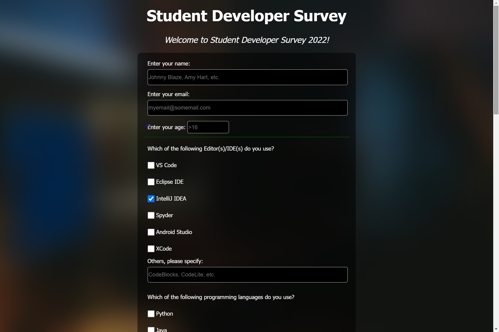
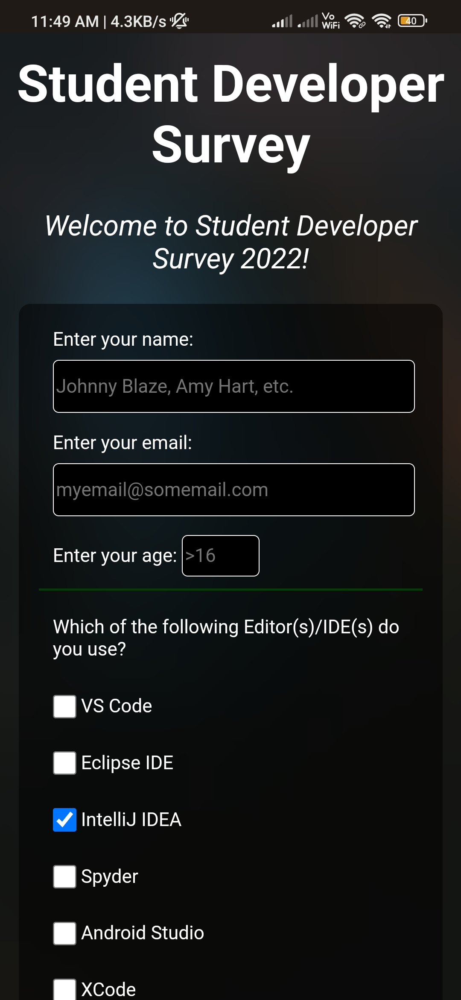

# Student Developer Survey Form

This is a static web page called Student Developer Survey Form built as a submission for my Responsive Wen Design Certification by freeCodeCamp. This is a static form focusing on responsiveness, i.e., working on multiple screen sizes.  
Note: This form doesn't submit information to anywhere.

## Table Of Contents 📖

- [Student Developer Survey Form](#student-developer-survey-form)
  - [Table Of Contents 📖](#table-of-contents-)
  - [Overview 🎯](#overview-)
    - [Screenshots 🖼️](#screenshots-️)
    - [Links 📌](#links-)
  - [My Process 📝](#my-process-)
    - [Built with 🛠️](#built-with-️)
    - [What I Learned 🗒️](#what-i-learned-️)
  - [Thanks For Visiting! 👨🏻‍💻](#thanks-for-visiting-)

## Overview 🎯

I created this project as a submission for the Responsive Web Design Certification by freeCodeCamp. The assignment was to create a survey form that can be usded to collect data from the users. The scope of the project was restricted to designing a responsive webpage containing the form, that would adapt to multiple scrren sizes.

At the time of creating the project I was a fresher, studying Computer Science & Engineering. I heard this fun term called "student developers", outside my college. So, this gave me the idea to build this "Student Developer Survey Form".

### Screenshots 🖼️

On Desktop

On Mobile

### Links 📌

- Live Site URL: [https://charanmn7.github.io/Student-Developer-Survey-Form/](https://charanmn7.github.io/Student-Developer-Survey-Form/)
- Project Repo: [https://github.com/CharanMN7/Student-Developer-Survey-Form](https://github.com/CharanMN7/Student-Developer-Survey-Form/)

## My Process 📝

My process was pretty straight forward, I followed the user stories to write the code which are tested upon submission. These tests are only checked for the HTML code I wrote. So, the page's design was left entirely to my will.

So, I started off by writing the boilerplate, then the `<form>`. I divided my form into multiple sections using the `<fieldset>`. The green borers you see are the borders of the `<fieldset>` element. The user stories specified to use various tags, at least a certain number of times. Therefore, I structured it the way that I felt was appropriate for my theme.

- The first `<fieldset>` asks for personal detials of the user.
- The second `<fieldset>` contains all the questions, each providing a different way to take input.
- The Third `<fieldset>` contains only a single question, about the privacy level of the information the user is sending.

At the end of the page, I added a footer with links. It wasn't a requirement in the project. I just thought it would be fun to add one.

As I mentioned earlier, the styling was entirely upto my choice. Here are a few things I did to style the page:

- Added a background image through CSS and blurred the body's background using `backdrop-filter`.
- Colored the background's of inputs with black and their borders with white.
- Colored the middle fieldset's top and bottom border with green.
- Added a slightly translucent black color to the background of the `form` and the `footer`

### Built with 🛠️

I used the following to build this site:

- HTML
- CSS
- GitHub(To host the background image and make it available in freeCodeCamp)

### What I Learned 🗒️

This is my first project. Although it was the first time, I didn't want to go simple on it. So, I was trying to use every thing in CSS I learnt up till that point. I was looking for ways to use images in the freeCodeCamp's editor. So, I hosted my background image on GitHub, and later the rest of the files of the site.

Working on this project gave me a taste of what it is like to build something from scratch, based on certain requirements. Also, this project allowed me use what I learned to visualize the design I had in my mind.

## Thanks For Visiting! 👨🏻‍💻

Check out my other projects:

- [Personal Portfolio Page](https://github.com/CharanMN7/Personal-Portfolio-Page/)
- [The To Do App](https://github.com/CharanMN7/To-Do-App)
- [QR code component](https://github.com/CharanMN7/QR-code-component)
- [Green Screen Background Image Editor](https://codepen.io/charan_/pen/OJEWzRX)
- [Simple Paint Canvas](https://codepen.io/charan_/pen/GRGrNyx)
- [Turn a colored image to grey](https://codepen.io/charan_/pen/GRGrEpP)
- [Python program to search through index named files](https://github.com/CharanMN7/file-search-feature)

Let's connect:

- [LinkedIn](https://www.linkedin.com/in/charan-manikanta/)
- [Twitter](https://twitter.com/CharanMN7)
- [My Blog](https://charan-blog.netlify.app/)
- [Hashnode](https://charanmn7.hashnode.dev/)
- [Medium](https://medium.com/@CharanMN7)
- [CodePen](https://codepen.io/charan_)
